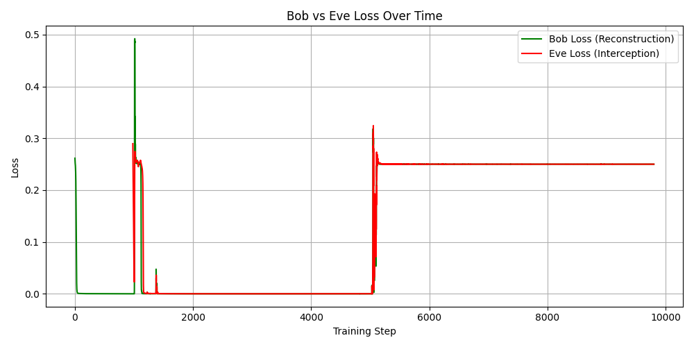

# 🔐 Adversarial Neural Cryptography

This repository implements and extends the ideas from:

> **Learning to Protect Communications with Adversarial Neural Cryptography**  
> Martín Abadi & David G. Andersen  
> [arXiv:1610.06918](https://arxiv.org/abs/1610.06918)

The project simulates secure communication between neural agents:

- **Alice** learns to encrypt a message using a shared key.
- **Bob** learns to decrypt the ciphertext using the same key.
- **Eve** tries to decrypt the message without access to the key.

The system is trained using **adversarial objectives**, such that:
- Bob accurately reconstructs the original message.
- Eve consistently fails to infer any useful information.

---

## 📁 Directory Structure

```

adv\_neural\_crypto/
├── data/                  # Synthetic binary data loader
├── modules/               # Alice, Bob, Eve neural models
├── trainers/              # LightningModule with manual optimization
├── utils/                 # Losses, metrics, logging
├── configs/               # YAML config files
├── experiments/           # Training script
├── scripts/               # Evaluation & plotting scripts
└── logs/                  # Stores loss logs and result plots

````

---

## 🧪 Sample Results

### 📊 Loss Curves



> In this plot:
> - Green = Bob's reconstruction loss (should ↓)
> - Red = Eve's interception loss (should ↑ or plateau)

---

## 🔧 Setup Instructions

### 🐍 Create a virtual environment:

```bash
python -m venv .venv
source .venv/bin/activate      # Linux/macOS
.\.venv\Scripts\activate       # Windows
````

### 📦 Install requirements:

```bash
pip install torch pytorch-lightning pyyaml matplotlib
```

Optional (for explainability/visuals):

```bash
pip install captum
```

---

## 📄 Configuration

Sample config in `configs/short.yml`:

```yaml
name: short
seq_len: 16
hidden: 256
batch_size: 512
epochs: 100
lr: 0.001
num_eves: 1
dataset_size: 10000
```

---

## 🚀 Training the Model

Run the training experiment:

```bash
python experiments/run_experiments.py configs/short.yml
```

This will:

* Train Alice and Bob for 10 warm-up epochs
* Introduce Eve thereafter
* Log results in `tb_logs/` and `logs/loss_log.pt`

---

## 📈 Visualize Loss Curve

Generate a loss-over-steps plot:

```bash
python scripts/plot_losses.py
```

Creates: `logs/loss_curve.png`

---

## 🧪 Evaluate Performance

After training:

```bash
python scripts/evaluate_model.py configs/short.yml
```

Example output:

```
📊 Evaluation Results:
🔐 Avg Bob Decryption Loss : 0.139570
🕵️  Avg Eve Interception Loss: 3.745024
```

---

## 📊 Metrics Interpretation

| Metric       | Description          | Ideal Value   |
| ------------ | -------------------- | ------------- |
| **Bob Loss** | Reconstruction error | \~0.0         |
| **Eve Loss** | Interception error   | >> Bob’s Loss |

---

## 🔁 Extensions & Research Directions

| Feature               | Description                                |
| --------------------- | ------------------------------------------ |
| 🧠 Transformer Crypto | Use attention layers instead of MLPs       |
| 🔀 Eve Ensembles      | Adversaries with diverse architectures     |
| 🔒 Selective Crypto   | Encrypt only sensitive parts of data       |
| 🌐 Federated Setup    | Secure communication in distributed agents |
| ℹ️  Info Losses       | Penalize mutual information with Eve       |

---

## 🧠 References

* Abadi, M., & Andersen, D. G. (2016). *Learning to Protect Communications with Adversarial Neural Cryptography.*
* Goodfellow, I. et al. (2014). *Generative Adversarial Nets.*
* DeepLearning.AI – *Practical training design & adversarial robustness.*

---

## 🙏 Credits

* Built using **PyTorch Lightning**
* Inspired by the original TensorFlow code from Abadi & Andersen
* Refactored, modularized, and extended for modern deep learning practice

---

## 📜 License

MIT License. Free to use, modify, and extend with attribution.

---

## ✅ To Do

* [ ] Add support for asymmetric neural crypto
* [ ] Deploy on encrypted messaging demo
* [ ] Add unit tests & experiment runners

```

---


python experiments/run_experiments.py configs/short.yml

python scripts/plot_losses.py

python scripts/evaluate_model.py configs/short.yml
